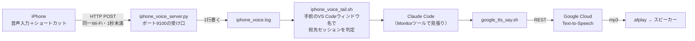

# ソファーで本を読みながらClaude Codeを使う — 指示は口で、返事は耳で

## 概要
Mac上の Claude Code を、キーボードの前に座らずに使うためのスクリプト一式。iPhoneに話しかけた内容が同一Wi-Fi内のHTTP直通（1秒未満）でMacに届き、Claude Code が「今こちらが言ったこと」として受け取って動き出す。返事は Google Cloud Text-to-Speech（Chirp3-HD）の自然な声でスピーカーから返る。入力を口に、出力を耳に置き換えることで、画面とキーボードから離れて運用できる。



## 構成（6役割・9本＋辞書1つ＋LaunchAgent 2本）

| 役割 | ファイル | 仕事 |
|---|---|---|
| 受け口 | `iphone_voice_server.py` | iPhoneからのPOSTを受けて、ログに1行書く |
| 受け渡し | `iphone_voice_hook.sh`<br>`iphone_voice_tail.sh` | 届いた1行を、正しいClaude Codeセッションに通す（複数セッションの取り合いは、手前のVS Codeウィンドウ名で判定して防ぐ） |
| 読み上げ | `google_tts_synth.sh`<br>`google_tts_say.sh`<br>`google_tts_queue.sh` | テキストをGoogleの声にして再生する。synth＝合成のみ（トークン50分キャッシュ・使用文字数の記録）／say＝再生と `say -v Kyoko` への自動切替（長い文は塊に割り、鳴らしている間に次の塊を合成する。前の読み上げが鳴っていたら止める）／queue＝再生中に次の合成を裏で進める |
| 返事の読み上げ | `talk_stop_hook.py`<br>`talk_reading_fixes.json` | Claude Code の Stop フックから呼ばれ、最後の返事を会話の記録から取り出し、声に向く形に整えて `google_tts_say.sh` に渡す／読み間違える語の辞書 |
| 読み上げの停止 | `tts_stop.sh` | 鳴っている読み上げと、裏で進んでいる合成を止める。ショートカット.app でキーに割り当てて使う |
| 音声入力の維持 | `dictation_keepalive.sh` | macOSの音声入力部品 DictationIM が発話終了から117秒で終了する（実測）ため、90秒ごとに起こして回る |
| 常駐設定 | `com.example.iphone-voice.plist`<br>`com.example.dictation-keepalive.plist` | 上記の受け口と維持スクリプトを LaunchAgent で回すための設定例 |

## セットアップ

1. スクリプト7本を `~/Library/Scripts/` に置き、`chmod +x` で実行権限を付ける
2. plist 2本の「あなたのユーザー名」を自分のmacOSユーザー名に書き換え、`~/Library/LaunchAgents/` に置いて `launchctl bootstrap gui/$(id -u) <plistのパス>` で読み込む
3. iPhoneのショートカットを作る（「テキストを音声入力」→「URLの内容を取得」。方法=POST・本文を要求=**ファイル**・変数「音声入力されたテキスト」。URLは自分のMacのローカルIP）
4. Claude Code の `~/.claude/settings.json` の SessionStart hook に `iphone_voice_hook.sh` を登録する
5. Google Cloud 側は `gcloud auth login` → `gcloud config set project <プロジェクトID>` → `gcloud services enable texttospeech.googleapis.com`。`google_tts_synth.sh` の `PROJECT` を自分のプロジェクトIDに書き換える
6. 動作確認：`google_tts_say.sh leda "聞こえていますか"`

詳しい手順・設計の理由・ハマりどころは解説記事に書いてある。

- Qiita: [ソファーで本を読みながらClaude Codeを使う——指示は口で、返事は耳で](https://qiita.com/tri-ponte/items/8917882a5a5b7b98506a)

## 続編：返事の読み上げを Stop フックで行う（2026-09 追加）

返事を声にする最後の配線を、CLAUDE.md の指示から Claude Code の Stop フックへ移した。返事を書き終えるたびに `talk_stop_hook.py` が動き、画面に出た最後の返事を読み上げる。

1. `talk_stop_hook.py`・`talk_reading_fixes.json`・`tts_stop.sh` を `~/Library/Scripts/` に置き、`talk_stop_hook.py` と `tts_stop.sh` に `chmod +x` で実行権限を付ける
2. `~/.claude/settings.json` の `hooks` に `Stop` を足す（「あなたのユーザー名」は書き換える）

```json
{
  "hooks": {
    "Stop": [
      {
        "hooks": [
          {
            "type": "command",
            "command": "/usr/bin/python3 /Users/あなたのユーザー名/Library/Scripts/talk_stop_hook.py",
            "timeout": 10
          }
        ]
      }
    ]
  }
}
```

3. 読み上げのオン・オフは旗のファイルで切り替える。`touch ~/Library/Scripts/talk_mode.on` でオン、`rm ~/Library/Scripts/talk_mode.on` でオフ。中にセッションIDを1行書くと、そのセッションの返事だけを読む
4. 声を出さずに確かめる：`TALK_DRY_RUN=1 /usr/bin/python3 ~/Library/Scripts/talk_stop_hook.py --text-file reply.md` で、声に渡る文が画面に出る
5. 途中で止めるキー：ショートカット.app で「シェルスクリプトを実行」に `$HOME/Library/Scripts/tts_stop.sh` を入れ、キーボードショートカットを割り当てる
6. CLAUDE.md に「返事を読み上げスクリプトでも読む」と書いていたら消す（フックと二重に読むため）

- 読み間違える語は `talk_reading_fixes.json` に足す。読ませたくない行は、同じファイルの「声から外す行」に正規表現で足す
- VS Code のターミナルで Claude Code 2.1.269 以降を使うと、Claude Code の入力欄にカーソルがあるときは、止めるキーがショートカット.app まで届かない（入力欄にスペースが入る）。入力欄の外をクリックしてから押す

## 注意

- 受け口は認証なしHTTPを `0.0.0.0` で待ち受ける。**自宅のWi-Fi限定**で使うこと（同じネットワークにいる人は誰でも送り込める。公衆Wi-Fiでは使わない）
- Google Cloud Text-to-Speech は無料枠が月100万文字（利用には課金アカウントが必要）。読み上げた文字数は `google_tts_usage.log` に自動記録される
- `dictation_keepalive.sh` の起動は `launchctl kickstart` 経由のみ。`open -a` はmacOSに拒否される
